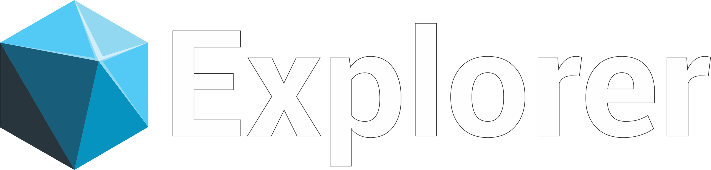

  

<h1></h1>

 O Rocketseat é uma plataforma de educação em tecnologia, onde estou realizando a formação Explorer, que é um programa que reune tudo o que é necessário para o desenvolvimento das habilidades técnicas e comportamentais.

  <a href="#-formacao">Formação</a>&nbsp;&nbsp;&nbsp;|&nbsp;&nbsp;&nbsp;
  <a href="#-projeto">Projetos</a>&nbsp;&nbsp;&nbsp;|&nbsp;&nbsp;&nbsp;
  <a href="#-layout">Eventos</a>&nbsp;&nbsp;&nbsp;

 

## 🔰 👨🏻‍🎓 **Formação Técnica**
Em construção... 🚧

Conhecimento adiquirido:

- HTML e CSS
- JavaScript
- Git e Github
 

## 🚀 🖥️  **Projetos**
 

## 📅 💻 **Eventos**
<h2>2003</h2>

 

[Link do Projeto](https://marcos-baia.github.io/Rocketseat/NLW-Setup/)

