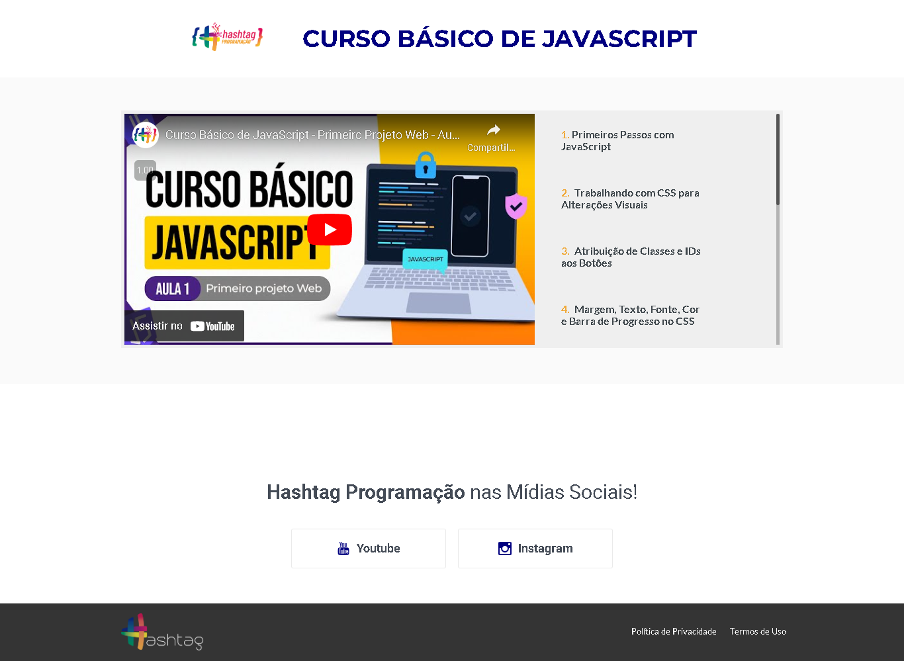

  

<h1></h1>

 O Hashtag Programação é uma plataforma de educação em tecnologia que oferece cursos e conteúdos para quem busca aprender sobre programação. Eles disponibilizaram um minicurso gratuito sobre conhecimentos básicos de JavaScript, com 10 aulas, no qual os alunos terá a oportunidade de desenvolver um player de música utilizando HTML, CSS e JS..

  

